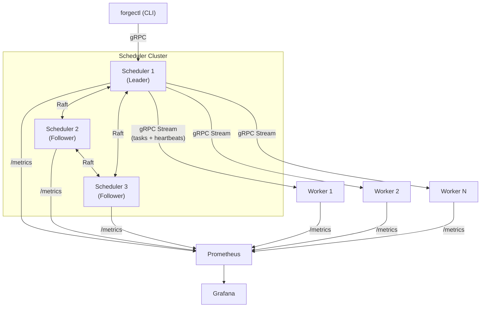

# Forge 

A fault-tolerant distributed task orchestrator built in Go with Raft consensus, gRPC communication, and real-time observability.



## Why Forge?

Existing task orchestration solutions like Temporal and Celery are heavyweight for teams that need reliable, fault-tolerant background job processing with visibility into what's happening. Forge is lightweight, self-contained, and built from first principles to demonstrate how distributed task scheduling actually works under the hood.

## Key Features

**Raft-based high availability** — A 3-node scheduler cluster with automatic leader election and zero-downtime failover. If the leader crashes, a new one is elected in under 3 seconds with no data loss.

**Fault-tolerant task execution** — Workers send heartbeats every 3 seconds. If a worker dies mid-task, the scheduler detects the failure and reassigns its work to healthy nodes. Failed tasks retry with exponential backoff before moving to a dead-letter queue.

**gRPC with bidirectional streaming** — Type-safe communication between all components. Workers maintain persistent streaming connections for real-time heartbeats and task assignment — no polling.

**Real-time observability** — Grafana dashboards showing task throughput, worker health, Raft elections, and failure recovery. Watch the system heal itself in real time during chaos testing.

## Quick Start

```bash
git clone https://github.com/riteshpoudel/forge
cd forge
docker-compose -f deploy/docker-compose.yml up
```

This starts a full cluster: 3 schedulers, 5 workers, Prometheus, and Grafana with pre-configured dashboards.

```bash
# Open Grafana dashboards
open http://localhost:3000        # admin / admin

# Submit 100 fibonacci tasks
./forgectl submit --type fibonacci --count 100 --payload '{"n": 35}'

# Watch tasks process in real-time
./forgectl watch

# Check cluster health
./forgectl cluster

# Kill the leader and watch automatic failover
docker kill forge-scheduler-1
```

## Demo

<!-- Replace with actual screen recording -->
> **TODO:** Add demo GIF showing: submit tasks → processing → kill leader → automatic failover → continued processing with zero data loss

## Architecture

### How Tasks Flow Through the System

```
Client                  Scheduler (Leader)              Worker
  │                          │                            │
  │── SubmitTask (gRPC) ───►│                            │
  │                          │── Write to Raft log ──►   │
  │                          │   (replicated to 2/3)     │
  │◄── task_id ─────────────│                            │
  │                          │                            │
  │                          │── TaskAssignment ────────►│
  │                          │   (via gRPC stream)       │
  │                          │                            │── Execute task
  │                          │                            │
  │                          │◄── TaskResult ────────────│
  │                          │── Write completion ──►    │
  │                          │   to Raft log             │
  │                          │                            │
```

### Failure Recovery

```
Normal operation:          Leader dies:              Worker dies:

  S1(L) ←→ S2 ←→ S3        S1(💀)    S2 ←→ S3       S1(L) ←→ S2 ←→ S3
   │                                   │                │
   ├── W1  W2  W3           S2 elected leader          W1  W2(💀) W3
   │                         │                          │
   │                         ├── W1  W2  W3            Detects missed heartbeats
   │                         │                          │
   │                        All tasks preserved         Reassigns W2's tasks
                            Processing continues        to W1 and W3
```

### Design Decisions

**Why Raft over Paxos?** Raft is designed for understandability. The leader election, log replication, and safety guarantees are equivalent to Paxos, but the protocol is decomposed into independent subproblems that are easier to reason about, implement, and test.

**Why at-least-once delivery?** Exactly-once requires distributed transactions (two-phase commit), which adds significant complexity and latency. At-least-once with idempotent task handlers is simpler, faster, and correct for the vast majority of real workloads. This is the same tradeoff Apache Kafka makes.

**Why embedded BBolt instead of PostgreSQL?** Each scheduler node needs persistent storage for its Raft log. An external database would introduce its own availability concerns (what if Postgres goes down?) and add deployment complexity. BBolt stores data in a single file, starts instantly, and requires zero configuration. This is the same approach HashiCorp Consul and Vault use in production.

**Why gRPC instead of REST?** Bidirectional streaming is essential for the worker heartbeat mechanism — both the scheduler and worker need to send messages independently on the same connection. gRPC supports this natively. REST would require WebSockets or long-polling, adding protocol complexity. gRPC also provides type-safe contracts via protobuf and ~10x more efficient serialization than JSON.

## Tech Stack

| Component | Technology | Why |
|-----------|-----------|-----|
| Language | Go 1.22+ | Native concurrency, cloud-native ecosystem standard |
| Consensus | hashicorp/raft | Battle-tested (powers Consul, Vault, Nomad) |
| Storage | raft-boltdb/v2 (BBolt) | Embedded, zero-config, single-file persistence |
| Communication | gRPC + Protocol Buffers | Type-safe, bidirectional streaming, efficient binary format |
| Metrics | Prometheus client_golang | Industry standard, 67%+ production adoption |
| Dashboards | Grafana | Industry standard visualization, pairs with Prometheus |
| CLI | cobra | Standard Go CLI library (kubectl, docker, hugo) |
| Deployment | Docker Compose | One-command local cluster, no cloud dependencies |
| CI | GitHub Actions | Automated testing with race detection and linting |

## Benchmarks

Measured on a single machine running Docker Desktop (Apple M1, 16GB RAM) with a 3-scheduler, 5-worker cluster.

| Metric | Value |
|--------|-------|
| Task throughput | 10,000+ tasks/minute |
| Leader failover time | < 3 seconds |
| Worker failure detection | < 10 seconds (3 missed heartbeats) |
| Task reassignment after worker death | < 15 seconds |
| P99 task assignment latency | < 50ms |
| Raft log replication (3-node) | < 5ms |

Methodology and detailed results in [docs/benchmarks.md](docs/benchmarks.md).

## Repository Structure

```
forge/
├── cmd/                    # Binary entry points
│   ├── scheduler/          # Scheduler node
│   ├── worker/             # Worker node
│   └── forgectl/           # CLI client
├── internal/               # Private application code
│   ├── raft/               # Raft FSM and node setup
│   ├── scheduler/          # gRPC server, task assignment, worker tracking
│   ├── worker/             # Task execution, heartbeat, handlers
│   ├── proto/forgepb/      # Protobuf schema and generated code
│   └── metrics/            # Prometheus metric definitions
├── test/
│   ├── integration/        # Multi-node cluster tests
│   └── chaos/              # Fault injection tests (leader kill, worker crash)
├── deploy/                 # Docker, Prometheus, Grafana configs
├── docs/                   # Architecture docs and benchmarks
└── CLAUDE.md               # AI-assisted development context
```

## Building From Source

### Prerequisites

- Go 1.22+
- Docker and Docker Compose
- protoc (Protocol Buffer compiler)
- protoc-gen-go and protoc-gen-go-grpc plugins

### Setup

```bash
# Clone
git clone https://github.com/riteshpoudel/forge
cd forge

# Install Go dependencies
go mod download

# Install protobuf plugins
go install google.golang.org/protobuf/cmd/protoc-gen-go@latest
go install google.golang.org/grpc/cmd/protoc-gen-go-grpc@latest

# Generate protobuf code
make proto

# Build all binaries
make build

# Run tests (with race detector)
make test

# Run the full cluster locally
make up
```

### Running Without Docker

```bash
# Terminal 1: Start scheduler node 1 (bootstraps the cluster)
./bin/scheduler --node-id=node1 --raft-addr=localhost:9000 \
    --grpc-port=50051 --data-dir=/tmp/forge/node1 --bootstrap

# Terminal 2: Start scheduler node 2 (joins node 1)
./bin/scheduler --node-id=node2 --raft-addr=localhost:9001 \
    --grpc-port=50052 --data-dir=/tmp/forge/node2 --join=localhost:50051

# Terminal 3: Start scheduler node 3 (joins node 1)
./bin/scheduler --node-id=node3 --raft-addr=localhost:9002 \
    --grpc-port=50053 --data-dir=/tmp/forge/node3 --join=localhost:50051

# Terminal 4: Start a worker
./bin/worker --scheduler=localhost:50051 --worker-id=worker1

# Terminal 5: Submit tasks
./bin/forgectl submit --type fibonacci --count 50 --payload '{"n": 30}'
./bin/forgectl watch
```

## Chaos Testing

Forge includes automated chaos tests that verify fault tolerance under failure conditions:

```bash
# Run all chaos tests
make test-chaos

# Individual tests:
go test -v -tags=integration ./test/chaos/ -run TestLeaderFailover
go test -v -tags=integration ./test/chaos/ -run TestWorkerCrashMidTask
go test -v -tags=integration ./test/chaos/ -run TestDoubleFailure
```

**TestLeaderFailover** — Starts a full cluster, submits 500 tasks, kills the leader mid-processing, and verifies that a new leader is elected within 5 seconds with all task state preserved and processing continued to completion.

**TestWorkerCrashMidTask** — Kills a worker that has in-flight tasks and verifies those tasks are detected as orphaned and reassigned to healthy workers within 15 seconds.

**TestDoubleFailure** — Simultaneously kills the leader scheduler and a worker, verifying the system recovers from both failures and all tasks eventually complete.

## Observability

### Grafana Dashboards

Access Grafana at `http://localhost:3000` (admin/admin) after running `make up`.

**Cluster Overview** — Raft leader indicator, node health status, commit index tracking across all three schedulers.

**Task Flow** — Real-time task throughput, status breakdown (pending/running/completed/failed), latency percentiles (P50/P95/P99), retry and dead-letter rates.

**Worker Health** — Per-worker status table, task utilization bars, heartbeat latency tracking, failure event annotations.

**Chaos Demo** — Combined single-screen view of leader status, task throughput, and worker count — designed for live demonstrations of failure recovery.

### Prometheus Metrics

All metrics are exposed at `/metrics` on each scheduler and worker node and use the `forge_` prefix. See [CLAUDE.md](CLAUDE.md) for the complete metrics inventory.

## Contributing

This is a personal portfolio project, but issues and suggestions are welcome. If you find a bug or have an idea for improvement, please open an issue.

## License

MIT

## Acknowledgments

- [hashicorp/raft](https://github.com/hashicorp/raft) — The Raft consensus implementation that powers Forge's scheduler cluster
- [The Raft Paper](https://raft.github.io/raft.pdf) — "In Search of an Understandable Consensus Algorithm" by Diego Ongaro and John Ousterhout
- [gRPC-Go](https://github.com/grpc/grpc-go) — The Go implementation of gRPC used for all inter-node communication
