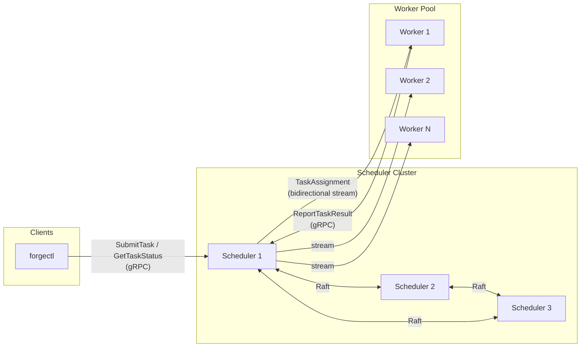
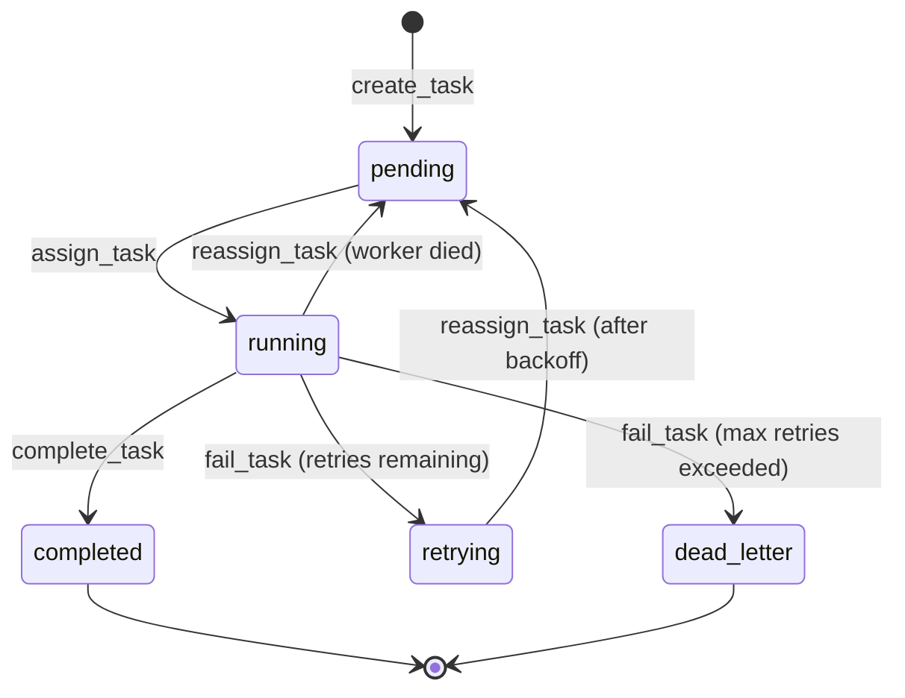

# Forge Architecture

## System Design

Forge has three components that work together to distribute and execute tasks reliably:



**Scheduler cluster (3 nodes)** — Accepts tasks from clients, stores them in a replicated Raft log, assigns them to workers, and tracks their lifecycle. Only the Raft leader handles writes (`SubmitTask`, `ReportTaskResult`). Any node can serve reads (`GetTaskStatus`).

**Worker pool (N nodes)** — Each worker opens a persistent bidirectional gRPC stream to the scheduler. The scheduler sends task assignments down the stream; the worker sends heartbeats up. Workers execute tasks through pluggable handlers and report results.

**CLI client (forgectl)** — Submits tasks, queries status, watches progress, and inspects cluster health. If connected to a follower, it automatically redirects to the leader.

### Data Flow

1. Client calls `SubmitTask` on the leader scheduler
2. Leader creates a `create_task` Raft command and applies it to the log
3. Raft replicates the command to a majority (2/3 nodes)
4. The assigner goroutine finds the pending task and matches it to a worker with available slots
5. Leader applies an `assign_task` command and sends a `TaskAssignment` to the worker via its gRPC stream
6. Worker executes the task using the appropriate handler
7. Worker calls `ReportTaskResult` with success/failure
8. Leader applies `complete_task` or `fail_task` to the Raft log

## Task State Machine

Every task follows this state machine, enforced by the FSM in [`internal/raft/fsm.go`](../internal/raft/fsm.go):



**FSM commands** are JSON-encoded in Raft log entries:

| Command | Effect |
|---------|--------|
| `create_task` | New task, status = `pending` |
| `assign_task` | Status = `running`, records assigned worker |
| `complete_task` | Status = `completed` |
| `fail_task` | Increments retry count. If under max retries: `retrying`. Otherwise: `dead_letter` |
| `reassign_task` | Resets to `pending`, clears assigned worker |

All state transitions go through Raft consensus, ensuring every node has an identical view of task state.

## Raft Consensus in Forge

Forge uses [hashicorp/raft](https://github.com/hashicorp/raft) — the same library that powers HashiCorp Consul, Vault, and Nomad.

### How It Works

The scheduler cluster maintains a replicated log of task state changes. When the leader receives a write request, it:

1. Appends the command to its local log
2. Sends the entry to all followers
3. Waits for a majority (2 of 3) to acknowledge
4. Commits the entry and applies it to the FSM
5. Returns the result to the caller

This guarantees that committed entries survive any single node failure.

### Leader-Only Writes

Only the leader can call `raft.Apply()`. The [`requireLeader()`](../internal/scheduler/server.go) check runs before every write operation. If a follower receives a write, it returns a `FailedPrecondition` error containing the leader's address so the client can redirect.

### Reads From Any Node

`GetTaskStatus` reads directly from the local FSM without going through Raft. This is safe because:
- Task state is append-only (tasks never go back to a previous state, except `retrying` → `pending`)
- Stale reads are acceptable for status queries — the client will see the latest state within one Raft heartbeat interval
- This avoids putting read load on the leader

### Storage

Each node persists its Raft log and stable store using [raft-boltdb/v2](https://github.com/hashicorp/raft-boltdb), which wraps BBolt (an embedded key-value store). A single `BoltStore` instance serves as both the `LogStore` and `StableStore`.

## Failure Modes and Recovery

### Leader Failure

If the leader crashes or becomes unreachable:

1. Followers stop receiving Raft heartbeats
2. After an election timeout (~1-2s), a follower starts an election
3. The candidate with the most up-to-date log wins
4. The new leader begins accepting writes immediately
5. All committed task state is preserved — nothing is lost

**Recovery time:** < 3 seconds from leader death to new leader accepting writes.

The [`trackWorkers()`](../internal/scheduler/worker_tracker.go) goroutine on the new leader detects the transition and handles orphaned tasks — any tasks that were `running` on the old leader's watch but whose workers are no longer connected get reset to `pending`.

### Worker Failure

Workers send heartbeats every 3 seconds via the bidirectional gRPC stream. If a worker misses 3 consecutive heartbeats (9 seconds):

1. The worker tracker marks it as dead
2. All tasks assigned to that worker (status = `running`) are found via `GetTasksByStatusAndWorker()`
3. Each task gets a `reassign_task` command applied through Raft, resetting it to `pending`
4. The dead worker is removed from the connected workers map
5. The assigner picks up the now-pending tasks and assigns them to healthy workers

**Detection time:** 9 seconds (3 missed heartbeats). **Reassignment time:** < 15 seconds total.

### Network Partition

Raft's safety guarantees prevent split-brain:

- A leader can only commit entries if it can reach a majority of the cluster
- If the leader is partitioned from the majority, it cannot commit writes and will step down
- The majority partition elects a new leader
- When the partition heals, the old leader discovers the new term and steps down

No task state is lost or duplicated during a partition.

### Retry with Exponential Backoff

When a task fails but has retries remaining, the [`computeBackoff()`](../internal/scheduler/retry.go) function calculates the delay:

```
backoff = min(60s, 1s * 2^(retryCount - 1))
```

| Retry | Backoff |
|-------|---------|
| 1     | 1s      |
| 2     | 2s      |
| 3     | 4s      |
| 4     | 8s      |
| 5     | 16s     |
| 6     | 32s     |
| 7+    | 60s     |

After the backoff expires, the retry scheduler applies a `reassign_task` command, moving the task back to `pending` for re-assignment.

## Why At-Least-Once Delivery (Not Exactly-Once)

Exactly-once delivery in a distributed system requires distributed transactions (two-phase commit or transaction logs shared between the scheduler and workers). This adds:

- **Latency** — Every task completion requires a two-phase protocol
- **Complexity** — Transaction coordinators, prepare/commit/abort paths, timeout handling
- **Availability trade-offs** — The system blocks if the transaction coordinator is unavailable

At-least-once delivery is simpler: if a task result is lost (worker crashes after executing but before reporting), the task is re-executed. This is correct as long as task handlers are **idempotent** — executing the same task twice produces the same result.

This is the same trade-off Apache Kafka makes for consumer processing, and the same model used by AWS SQS, Google Cloud Tasks, and most production job queues.

Forge's task handlers (fibonacci, sleep, HTTP check) are all naturally idempotent. For handlers that aren't (e.g., sending an email), the handler should implement its own deduplication using the task ID.

## Why BBolt (Not Postgres)

Each scheduler node needs persistent storage for its Raft log. Using an external database like PostgreSQL would:

- **Introduce its own availability problem** — If Postgres goes down, the scheduler can't persist Raft entries, defeating the purpose of high availability
- **Add deployment complexity** — A Postgres cluster per scheduler node, or a shared Postgres with its own replication
- **Add network latency** — Every Raft commit would require a network round-trip to Postgres

BBolt (the embedded key-value store wrapped by raft-boltdb/v2) stores everything in a single file on local disk:

- **Zero configuration** — No connection strings, no schema migrations, no users
- **Starts instantly** — No separate process to wait for
- **Co-located with the process** — Disk I/O, not network I/O
- **Battle-tested** — HashiCorp Consul and Vault use the same approach in production

## Why gRPC (Not REST)

The worker heartbeat mechanism requires **bidirectional streaming** — both the scheduler and worker need to send messages independently on the same connection:

- **Scheduler → Worker:** Task assignments (pushed when available, not polled)
- **Worker → Scheduler:** Heartbeats every 3 seconds + capability updates

With REST, this would require either:
- **WebSockets** — Adding a second protocol alongside HTTP, with its own connection management
- **Long-polling** — Inefficient, high latency, complex timeout handling
- **Server-Sent Events** — Only server-to-client, still need a separate channel for heartbeats

gRPC supports bidirectional streaming natively via HTTP/2. A single `RegisterWorker` RPC opens a persistent stream that both sides can write to independently.

Additional benefits:
- **Type-safe contracts** — Protocol Buffers define the schema once, generating client and server code in any language
- **Efficient serialization** — Protobuf binary encoding is ~10x smaller and faster than JSON
- **Deadline propagation** — gRPC contexts carry timeouts end-to-end
- **Code generation** — `protoc` generates the full client/server interface, eliminating hand-written HTTP handlers
